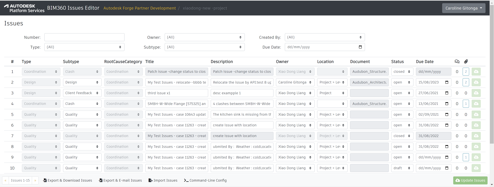

# BIM360 Issue Editor


[](https://forge.autodesk.com/en/docs/data/v2/reference)
[](https://forge.autodesk.com/en/docs/bim360/v1/reference)


Prototype application for bulk-editing [BIM 360](https://www.autodesk.com/bim-360/) issues
using [Autodesk Platform Services](https://aps.autodesk.com) APIs.



## Running

### Web Application

Live demo is running on https://bim360-issue-editor-v2.autodesk.io.

In order to be able to access your BIM 360 project from this demo, you will need to add
the following APS credentials as a [custom integration](https://forge.autodesk.com/en/docs/bim360/v1/tutorials/getting-started/manage-access-to-docs):

- APS Client ID: `gnChEZ6tph1H9IAelM2mYufYZVU1qqKt`
- APS App Name: `Internal BIM360 Testing App`

### Command-Line Utility

The project includes two command-line scripts (under the _bin/_ folder) that can be used
to export issues to XLSX and import them back, locally. The scripts require a configuration
file that is generated by the web application.

> Since the configuration contains sensitive data such as authentication tokens,
> The download is controlled using the boolean `ALLOW_CONFIG_DOWNLOAD` environment variable.
> `ALLOW_CONFIG_DOWNLOAD` is set to false by default to disable the download,
> set this variable to true to enable this feature

1. Navigate to the issue page for one of your BIM360 projects
2. Use the "Command-Line Config" button in the bottom toolbar
3. Download the archive and extract the configuration JSON
4. Open your command-line (make sure that you have [Node.js](https://nodejs.org/en) installed), and navigate to this project's root folder
5. Try one of the following commands:
  - To export BIM360 issues to XLSX: `node bin/bim360-to-excel.js <path/to/unzipped/config.json> <path/to/output/spreadsheet.xlsx>`
  - To import issues from XLSX back to BIM360: `node bin/excel-to-bim360.js <path/to/unzipped/config.json> <path/to/input/spreadsheet.xlsx>`
    - Optionally, include the `--sequential` parameter to update issues in sequence instead of in parallel
    - Optionally, include a `--range=<starting_row_number>-<ending_row_number>` parameter to only update issues in a given range of spreadsheet rows
  > The scripts assume that the path to the spreadsheet is valid, so make sure that the entire folders structure is available

## Development

### Prerequisites

- [Node.js](https://nodejs.org) v10.15 or newer, and [yarn](https://yarnpkg.com)
- APS application credentials ([creating an app](https://forge.autodesk.com/en/docs/oauth/v2/tutorials/create-app/))
  - Callback URL of the APS application must be set to your host followed by `/auth/callback` so, for example, when running the application locally, the URL should be `http://localhost:3000/auth/callback`
- BIM 360 project with the APS application added as a [custom integration](https://forge.autodesk.com/en/docs/bim360/v1/tutorials/getting-started/manage-access-to-docs)

### Setup

- clone this repository
- install dependencies: `yarn install`
- provide the following env. variables
  - `APS_CLIENT_ID` - client ID of your APS application
  - `APS_CLIENT_SECRET` - client secret of your APS application
  - `APS_APP_NAME` - name of your APS application (used when asking user to setup the BIM 360 integration)
  - `HOST_URL` - URL where the demo application is running (for example, _http://localhost:3000_)
  - `SERVER_SESSION_SECRET` - secret phrase used to encrypt session cookies
  - `ALLOW_CONFIG_DOWNLOAD`-  set to false by default

#### On macOS

```bash
export APS_CLIENT_ID=<client id>
export APS_CLIENT_SECRET=<client secret>
export APS_APP_NAME=<app name>
export HOST_URL=<host url>
export SERVER_SESSION_SECRET=<secret phrase>
export ALLOW_CONFIG_DOWNLOAD=<false>
yarn start
```

#### On Windows

```
set APS_CLIENT_ID=<client id>
set APS_CLIENT_SECRET=<client secret>
set APS_APP_NAME=<app name>
set HOST_URL=<host url>
set SERVER_SESSION_SECRET=<secret phrase>
set ALLOW_CONFIG_DOWNLOAD=<false>
yarn start
```

#### Using VSCode

When using [Visual Studio Code](https://code.visualstudio.com), add this configuration to your _.vscode/launch.json_:

```json
{
    "type": "node",
    "request": "launch",
    "name": "Launch Server",
    "program": "${workspaceFolder}/server.js",
    "env": {
        "APS_CLIENT_ID": "<client id>",
        "APS_CLIENT_SECRET": "<client secret>",
        "APS_APP_NAME": "<app name>",
        "HOST_URL": "<host url>",
        "SERVER_SESSION_SECRET": "<secret phrase>",
        "ALLOW_CONFIG_DOWNLOAD": "<false>"
    }
}
```

## License

This sample is licensed under the terms of the [MIT License](https://tldrlegal.com/license/mit-license).
Refer to [LICENSE](LICENSE) for more details.

## Author

Petr Broz ([@ipetrbroz](https://twitter.com/ipetrbroz)), APS Developer Advocates
